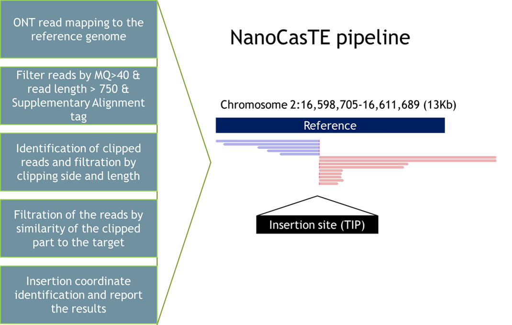

# NanoCasTE
NanoCasTE is a new pipeline for detection of Transposable Element Insertions (TEIs) using Nanopore reads obtaining after CANS (Cas9-targeted Nanopore Sequencing (CANS, [Gilpatrick et al., Nature Biotechnolgy, 2021](https://www.nature.com/articles/s41587-020-0407-5)) sequencing.

*Figure 1*. A workflow of NanoCasTE pipeline

NanoCasTE has several steps (Figure 1): (1) Mapping the reads to the genome using minimap2 (Li 2018) followed by sorted bam file generation using samtools (Li et al. 2009); (2) Filtration of the reads by mapping quality (MQ>40), read length (>750) and SA tag (no supplementary alignments are allowed); (3) Selection of the mapped reads with clipped head (reads mapped on the positive strand) or tail (reads mapped on the negative strand) and the length of the clipped parts closed to the distance from gRNA positions to the TE end; (4) Filtration of the reads by similarity of the clipped part to the target TE sequence; (5) Identification of the inserted sites, TE orientation (+ or - strand) and output the results.

## How to run
NanoCasTE pipeline is written in python and can be run by two alternative ways.

### Option 1: Run NanoCasTE using Snakefile
There is a snakefile available that can be used to create bam file with mapped reads and then run NanoCasTE.py script. For this, you need to do the following steps:
1. Navigate to the NanoCasTE folder containing Snakefile
2. Copy your fastq file with CANS reads (e.g. rdp3.fastq), fasta file of your target sequence (e.g. evd.fasta) and fasta of genome sequence (e.g. GCF_000001735.4_TAIR10.1_genomic.fna for TAIR10 genome used in our work) into 'data' directory (./data)
3. Create a file named configfile.yaml and fill in the required fields. There is an example of configfile.yaml that was used for EVD TEI identification in TAIR10 genome with the following content:
target: data/evd.fasta

guides: 'TCTTGGTGATGAGAGTGAC,ACCCTGGATTTAAGGTGAGA,AGTTTAAGAGCTCTAGTATG,CTACAAGGTCAATCGAAAGG,TCAACACATGAAAGTCCCGA'  
genome_fasta: data/GCF_000001735.4_TAIR10.1_genomic.fna  
min_len_clipped: 0.9  
mapping_quality: 40  
min_read_length: 750  
long_clipped_report: 4000  

4. An example of the command (for EVD TEI detection using fastq file called rdp3.fastq) that must be run from NanoCasTE directory:
  
`snakemake -f --use-conda --core 150 rdp3.nct`  

where rdp3.nct is an output file of NanoCasTE and the name of this file must be derived from the name of fastq file (without .fastq) + '.nct'

### Option 2: Run NanoCasTE using .bam file
NanoCasTE can be run directly without Snakefile. For this, you need to obtain sorted bam file after [minimap2](https://github.com/lh3/minimap2) mapping of the reads to the genome and the corresponding index file (.bai). You also need a file containing sequence of the target in fasta format. NanoCasTE has several dependencies (listed in environment.yaml file that can be used to create conda enviroment) that need to be installed : 
* python =3.6
* pysam =0.15.0
* samtools =1.9
* biopython =1.76
  
Description of all arguments are listed below:  

#### positional arguments:
  **sorted_bam**            path to bam file after minimap2 mapping  
  **reads**                path to fastq file of reads  
  **target_fasta**          path to target sequence in fasta format  
  **guides**                path to quide RNA fasta file  
  **outBed**                path to bed file  

#### optional arguments:
  *-mrl*  or *--min_read_length*   minimum read length  (Default value: 750)
  *-q* or *--map_q*  minimum mapping quality  (Default value: 60)
  *-mlc* or *--min_len_clipped*   minimum coverage of clipped part  (Default value: 0.6)
  *-mlcr* or *--long_clipped_report*   minimum length of the clipped part to be reported. If the length of the clipped part of a read will be longer than this value then it will reported during NanoCasTE running  (Default value: 5000)

`usage: NanoCasTE.py [-h] [-mrl MIN_READ_LENGTH] [-q MAP_Q]
                    [-mlc MIN_LEN_CLIPPED] [-mlcr LONG_CLIPPED_REPORT]
                    sorted_bam reads target_fasta guides outBed
`

An example of the command using files from data and mapped_reads directories of NanoCasTE GitHub directory:

`python3 NanoCasTE.py mapped_reads/sorted_rdp3.bam data/rdp3.fastq data/evd.fasta 'TCTTGGTGATGAGAGTGAC,ACCCTGGATTTAAGGTGAGA,AGTTTAAGAGCTCTAGTATG,CTACAAGGTCAATCGAAAGG,TCAACACATGAAAGTCCCGA' rdp3_nanocaste`

## Output files
NanoCasTE outputs two text files:
1. .nct file. This is tab separated table with the follwoing columns:
    * Chromosome:Start..End
    * No + reads. This column shows the number of reads in the TEI that were mapped to the forward strand
    * Clipped lengths of + reads. This column contains an information about the length of the clipped parts for the reads in the TEI that were mapped to the forward strand
    * No - reads This column shows the number of reads in the TEI that were mapped to the reverse strand
    * Clipped lengths of - reads. This column contains an information about the length of the clipped parts for the reads in the TEI that were mapped to the reversed strand	
    * Total number of reads in the region. This column shows the total number of reads in the TEI region. This information is useful when highly-covered (usually centromeric repeat region) genomic regions need to be filtered.

2. .nctbed file which is simple bed file of genomic coordinates of all deected TEIs.
 
## NanoCasTE citation
We are currently preparing the manuscript.

 
